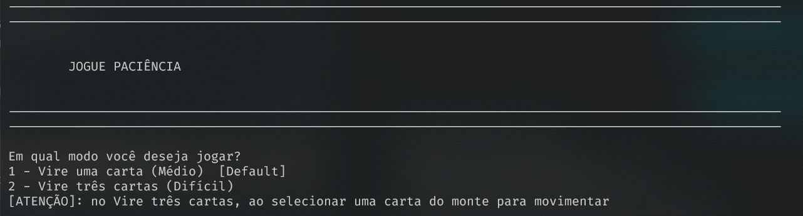
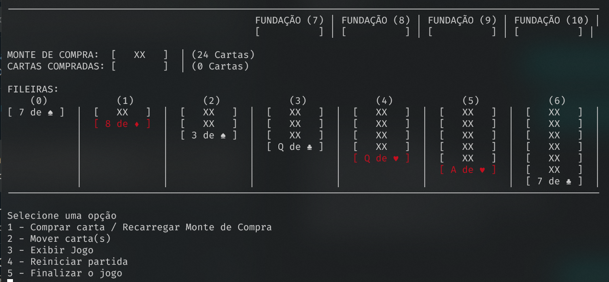
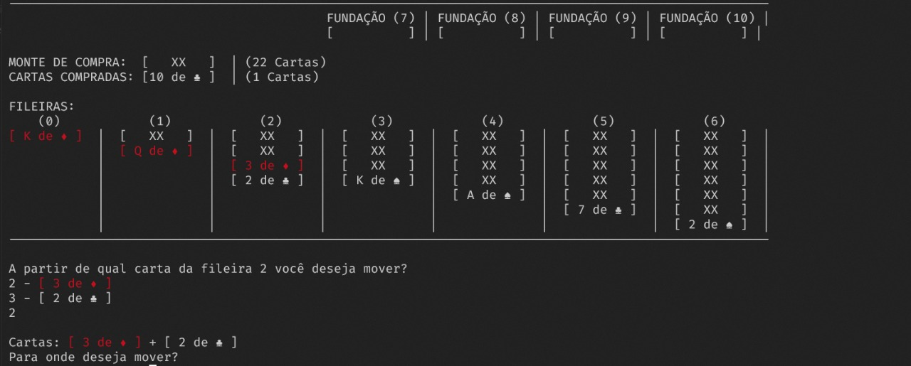

# Instruções de jogo (Paciência)

### Objetivo

- Mover todas as cartas para as Fundações.

### Detalhes

#### Fundações

- Em ordem crescente e com o mesmo naipe.
- A carta do topo pode ser movimentada.

#### Pilhas

- Devem ser organizada em ordem decrescente e com cores alternadas;
- As cartas do topo podem ser movimentadas
- Pilhas completas e incompletas podem ser movimentadas
- Espaços vazios podem ser ocupados pelo Rei ou por pilhas que contenham o Rei.

#### Estoque

- Selecione a opção para virar, dependendo do jogo, uma ou três cartas
- Quando esvaziar, selecione a mesma opção para que as cartas do descarte voltem para o estoque.

#### Descarte

- Apenas a carta do topo pode ser movimentada.

Fonte: Haja paciência

 

# Jogando

Ao dar run no jogo, você entra no painel para escolher o nível de dificuldade do jogo que você quer jogar.

 

Ao iniciar um novo jogo você irá encontrar o painel do Paciência como mostra na imagem abaixo. Nele contém um menu onde você pode selecionar a opção desejada

Para fazer uma movimentação, o menu irá indicar de onde você quer fazer a movimentação e para onde. Caso for das cartas compradas, ou de uma fileira que só tenha uma carta, ele já seleciona automaticamente a única carta e pergunta para onde você quer enviar. Caso seja de uma fileira onde tem mais de uma carta virada, ele irá perguntar a partir de que carta você quer movimentar.

Repita o movimento de movimentação das cartas até conseguir preencher todas as fundações.

 
 

> Obs.: Você tem a opção de reiniciar um novo jogo ou iniciar a mesma partida do começo no menu durante o jogo. As entradas inválidas não interromperão o fluxo do jogo, você só será avisado do erro e o menu vai reestartar de onde você parou.
