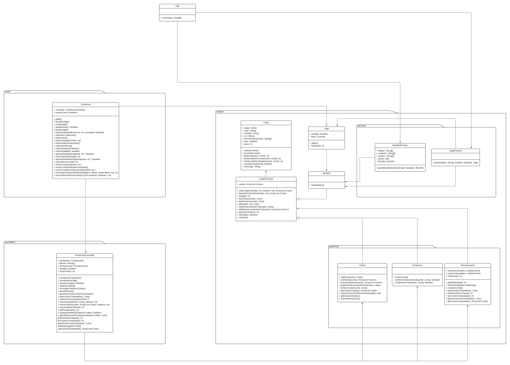

# Arquitetura e Padrões de projeto

## Diagrama do projeto



Você também pode acessar o diagrama do projeto em na pasta [doc/Diagrama.pdf](./Diagrama.pdf)

# Arquitetura

A arquitetura utilizada nesse projeto foi a MVC (Model - View - Controller)

# Padrões

### Factory

- Geração de um baralho
- Geração de um Jogo a partir de uma `option`

<br/>

# Lógica do programa

## Main

O método main chama uma factory de baralho, onde pode ser passados algumas opções para ele como:

- quantidade de baralhos [implementado]
- gerar um baralho com cartas coringa [Não implementado]

Logo após ele passa por outra factory para gerar um jogo, e aciona o método jogar()

> Na parte 1 do projeto foi proposto a implementação somente do jogo Paciência, por isso no método main já é implementado a opção `paciencia` como default.

```java
public class App {
    public static void main(String[] args) throws Exception {
        BaralhoFactory baralhoFactory = new BaralhoFactory();
        boolean embaralhado = true;
        Baralho baralho = baralhoFactory.gerarBaralho(embaralhado);

        String option = "paciencia";
        Jogo jogo = JogoFactory.gerar(option, baralho);
        jogo.jogar();
    }
}
```

## Jogo


A classe jogo é uma superclasse de onde é derivados os Jogos de carta que vão ser implementados nesse código fonte. Com ela pode-se ter acesso a uma instancia de `Baralho` e do input do teclado (Onde vai receber os comandos do jogo), e também tem os métodos `Jogar()` que deve ser sobrescrito nas classes filhas com os jogos que serão implmementados e `inputInt()` para pegar uma entrada de dados já convertida e tratada para inteiro

## Carta

A classe carta guarda as informações comuns de uma carta de baralho como: `naipe`, `valor`, `simbolo` da carta; e outros valores como `ansiTerminalColor` (Array de String com dois valores onde guarda os códigos para colorir a carta no terminal), `face` para saber se a carta está a mostra ou não e `peso` para fazer métricas de distância entre as cartas durante o jogo.

```java
public class Carta {
  public final String naipe;
  public final String valor;
  public final String simbolo;
  public final String cor;
  public String ansiTerminalColor[];
  public boolean face;
  public final int peso;

  //...
  //Metodos
}
```

## Lista de cartas

Uma das decisões de projeto foi implementar a classe `ListaDeCartas`, onde tem como único atributo um `ArrayList` de `Carta`. Desse jeito pode-se implementar métodos que são comuns as classes que vão ser lista de cartas, como as classes:

- Baralho
- Fileira
- fundação
- Remanecente

Ela pode se comportar como uma classe pai (A classe só tem uma lista de cartas ex.: `Baralho`) ou como um atributo normal (ex.: caso excepcional `Remanecente` onde se tem duas listas de cartas: O monte de compra e as cartas compradas)

Sendo assim, cada classe que for ou tiver uma `ListaDeCartas` pode implementar suas próprias regras de negocio e reaproveitar métodos comuns entre si.

## Paciencia

As classes que extenderão a classe Jogo são views.
Nessa classe são implementadas toda a comunicação com o usuário, e tem por intermédios do seu controller específico pra fazer o controle do jogo.

## PacienciaController

Onde se instancia o jogo com todos os seus componentes (7 fileiras, 4 fundações e 1 remanecente), e faz intermeio entre a view e esses componentes.

> No jogo Paciência as regras de negocio (Regras de inserção e remoção de Carta, etc) não ficam no controller diretamente, e sim em sua própria classe, mas esse comportamento pode ser mudado na implementação de outro jogo, já que esse pode ter seu próprio padrão de desenvolvimento.
